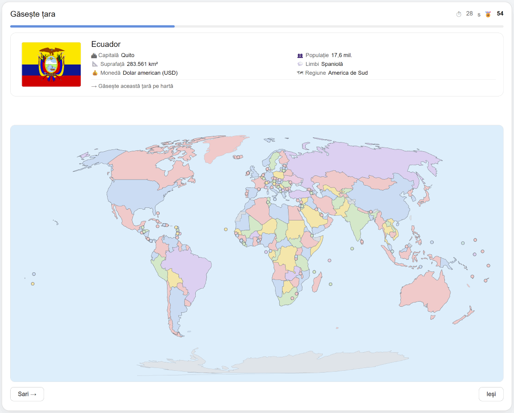

# GeoQuiz

GeoQuiz este un joc educativ de geografie care rulează direct în browser. Oferă trei moduri principale: **Găsește țara**, **Găsește capitala** și **Găsește drapelul**, alături de Campionat, Statistici și o secțiune Despre.



## Rulare locală

Aplicația poate fi deschisă direct prin fișierul `index.html` pentru utilizarea obișnuită.

Pentru funcțiile PWA și service worker, proiectul trebuie servit prin HTTP. Din folderul proiectului:

```bash
python -m http.server 8000
```

Apoi deschide în browser:

```text
http://localhost:8000/
```

## PWA și funcționare offline

GeoQuiz poate fi instalat ca PWA. Fișierele aplicației, datele despre țări, cele 250 de steaguri SVG, geometria Natural Earth la scara 1:50m și stratul local pentru zonele disputate sunt incluse în proiect și pot fi memorate în cache pentru utilizare offline.

Pentru instalarea PWA și funcționarea service worker-ului este necesară rularea prin `http://localhost` sau prin HTTPS.

## Moduri de joc

- **Găsește țara** — identificarea statelor direct pe hartă.
- **Găsește capitala** — asocierea a 6 capitale cu țările corespunzătoare, prin drag & drop sau prin selectare succesivă cu click/touch. După o asociere corectă, capitala rămâne afișată lângă țară.
- **Găsește drapelul** — asocierea a 6 drapele cu țările corespunzătoare, tot prin drag & drop sau click/touch. După o asociere corectă, drapelul rămâne afișat lângă țară.

## Profiluri cartografice

GeoQuiz permite alegerea profilului folosit pentru entitățile selectabile:

- **Atlas școlar** — folosește statele membre ONU; teritoriile cu statut contestat sunt afișate neutru și nu sunt răspunsuri separate.
- **ONU – 193 de state membre** — sunt selectabile cele 193 de state membre ale Organizației Națiunilor Unite.
- **ONU + două state observatoare** — include cele 193 de state membre ONU, plus Statul Palestina și Vaticanul ca state observatoare.
- **ISO 3166 – țări și teritorii** — include țările și teritoriile cu cod ISO 3166 disponibile în setul cartografic; zonele cu statut contestat rămân afișate neutru.

## Date cartografice

- `data/ne_50m_admin_0_countries.geojson` — Natural Earth Admin 0 Countries, scara 1:50m.
- `data/ne_50m_admin_0_breakaway_disputed_areas.geojson` — Natural Earth Breakaway / Disputed Areas, scara 1:50m.
- `data/map-data.js` — hartă locală de rezervă.
- `data/disputed-data.js` — strat local folosit pentru afișarea neutră a zonelor disputate.

Harta de bază Natural Earth reflectă în principal reprezentarea administrativă și situația de facto folosită de sursa cartografică. Pentru ca GeoQuiz să nu atribuie implicit unei țări teritorii al căror statut este contestat, peste harta de bază este afișat un strat neutru pentru zonele disputate. Acest strat nu exprimă o poziție politică a aplicației și nu transformă automat zonele respective în răspunsuri ale jocului.

## Steaguri

Steagurile vectoriale SVG din directorul `assets/flags/` provin din proiectul **Flag Icons 7.5.0** (`lipis/flag-icons`) și sunt distribuite sub licența MIT. O copie a licenței este inclusă în `assets/flags/LICENSE-flag-icons.txt`.

Pentru detalii despre sursele externe și licențe, vezi `THIRD_PARTY_NOTICES.md`.

## Interacțiune și progres

- Statele foarte mici folosesc markere cu zone de click adaptate automat în funcție de distanța față de markerii vecini.
- Feedback-ul corect/greșit este afișat fără a deplasa restul interfeței.
- Campionatul și statisticile sunt păstrate local și pot fi resetate separat din interfață.
- Teritoriile dependente pot fi afișate în culoarea statului suveran în profilurile în care nu reprezintă răspunsuri separate; în profilul ISO pot deveni entități selectabile individual.
- Feedback-ul textual important folosește `aria-live="polite"` pentru compatibilitate mai bună cu cititoarele de ecran.

## Credite

Aplicația este concepută, testată și integrată de **Gabriel Valentin Cristescu**, cu asistență AI în procesul de implementare. Datele, bibliotecile și serviciile externe sunt utilizate conform licențelor și condițiilor proprii.

## Istoric versiuni

### v1.7.5

- Uniformizare vizuală pentru modurile **Găsește capitala** și **Găsește drapelul**.
- Capitala asociată corect rămâne vizibilă lângă țară, fără accent tipografic excesiv.
- Spațiere uniformă pentru titlurile coloanelor `Capitale / Țări` și `Drapele / Țări`.

### v1.7.4

- După o asociere corectă în **Găsește capitala**, perechea rămâne vizibilă, de exemplu `România — București`.

### v1.7.3

- Revizie editorială și uniformizarea textelor publice din interfață.

### v1.7.2

- Rescrierea descrierilor publice pentru profilurile cartografice.

### v1.7.1

- Meniul principal reorganizat în două rânduri: cele trei moduri de joc, apoi Campionat / Statistici / Despre.
- Modul cu capitale și modul cu drapele folosesc aceeași logică de drag & drop și selectare prin click/touch.
- După o asociere corectă în **Găsește drapelul**, steagul rămâne afișat lângă țară.
- Secțiunea **Despre** devine ecran propriu.

### v1.7.0

- Adăugat modul **Găsește drapelul**.
- Corecții pentru afișarea și interactivitatea Groenlandei în hărțile regionale.

### v1.6.x

- Migrare la Natural Earth 1:50m local.
- Adăugarea stratului neutru pentru zone disputate.
- Îmbunătățirea markerelor pentru microstate și a comportamentului PWA/offline.
